# Lab 1 - Plan a Client Summit with Microsoft 365 Copilot Chat

## Lab Overview

In this lab, you’ll take on the role of a business operations associate tasked with planning a Client Innovation Summit. Using Microsoft 365 Copilot Chat, you’ll explore how AI can support event planning by summarizing industry trends, brainstorming ideas, creating visuals, drafting documentation, and collaborating with colleagues.

The lab is designed to showcase real-world use cases of Copilot Chat for productivity, creativity, and collaboration—all within the Microsoft 365 ecosystem. By the end of this lab, you’ll have used Copilot to create a professional event planning brief and supporting materials.

## Lab Objectives

In this lab, you will be able to complete the following tasks:

  - **Task 1**: Summarize Industry Trends for Event Planning  
  
  - **Task 2**: Brainstorm and Draft Session Ideas 
  
  - **Task 3**: Visualize the Agenda Timeline and Create a Logo 

  - **Task 4**: Draft a Planning Document for the Summit 
  
  - **Task 5**: Analyze and Generate Content from a File 
 
  - **Task 6**: Collaborate Using Copilot Pages 

  - **Task 7**: Reflect and Apply Your Learning 

## Before you start

Before you can start this lab, you'll need to log into your virtual machine and launch the Microsoft 365 Copilot Chat web app. Follow the steps below to get started: 

1.On the LabVM, click on **Microsoft Edge** from the taskbar to open the browser.

1. To launch Microsoft 365 Copilot Chat, enter `https://m365copilot.com` in the address bar and a dialogue box will prompt you to sign in.
   
2. You'll see the **Sign in** tab. Here, enter your credentials:
 
   - **Email/Username:** <inject key="AzureAdUserEmail"></inject>
 
       
 
3. Next, provide your password:
 
   - **Password:** <inject key="AzureAdUserPassword"></inject>

       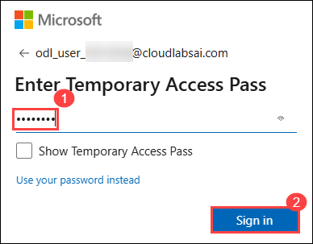
   
1. If prompted to **Stay signed in?**, select the **Don't show this again** checkbox, then select **Yes**.
   
1. The Microsoft 365 Copilot Chat web app should launch, if not, select the **Copilot icon** on the left navigation menu to open Copilot Chat.

You are ready to begin Task 1. 

## Task 1: Summarize industry trends for event planning

In this task, you’ll explore how Copilot Chat can help you quickly identify key innovation trends from the web that are relevant to your summit. This is the foundation for shaping the event agenda around meaningful topics that resonate with your client audience.

1. Enter this prompt in the prompt box at the bottom of the Copilot Chat:

    ```
    What are the top three innovation trends in [your industry] for 2025 and how can they shape the agenda for a client summit?
    ```
   
   **NOTE:** Replace [industry] with the industry of your choosing.

1. Select **Send (arrow icon)** on bottom right of the prompt box or select **Enter** on your keyboard. 

   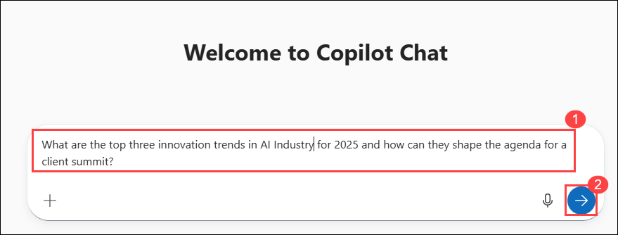

1. Review the information provided by Copilot and if needed, refine the prompt.

## Task 2: Brainstorm and draft session ideas 

In this task, you will build on the trends identified in Task 1 by asking Copilot to generate session titles and descriptions. You’ll refine the tone to ensure the sessions are engaging, professional, and aligned with your summit’s goals.

1. In the same chat with Copilot, enter this prompt:

    ```
    Based on those trends, suggest 5 engaging session titles and write short descriptions for a client innovation summit.
    ```

1. Select **Send**, review the information provided by Copilot and if needed, refine the prompt.

    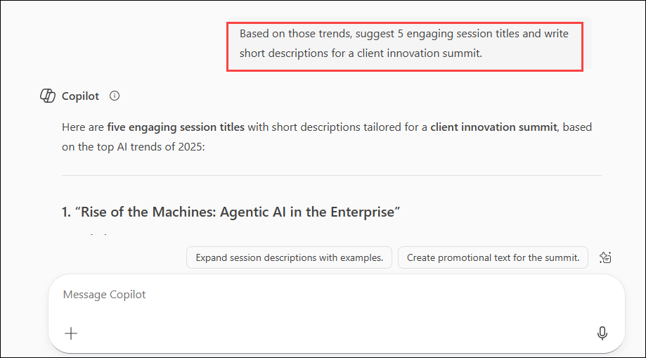

1. Enter this follow-up prompt:

    ```
    Make the descriptions more compelling by using an energizing and professional tone.
    ```

1. Select **Send**, review the information provided by Copilot and if needed, refine the prompt.

    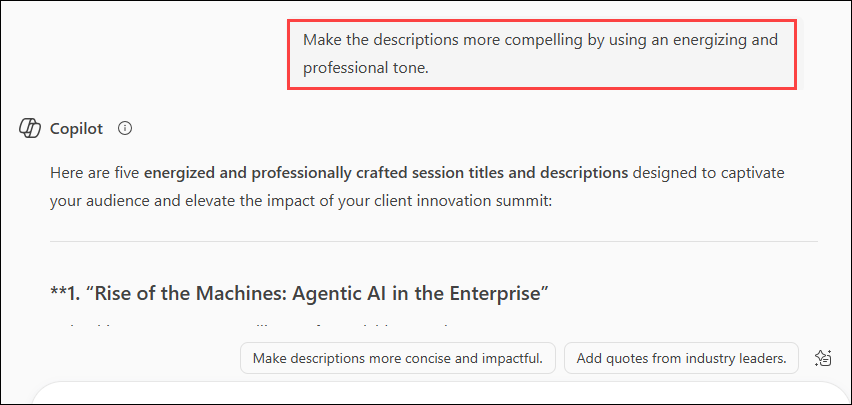

## Task 3: Visualize the agenda timeline and create a logo

Copilot Chat can help you quickly convert text-based ideas into visual content. In this task, you will use Copilot to create a visual timeline for your 1-day summit in table format. You will also generate a simple, modern logo to represent the event, useful for both promotional materials and branding.

1. In the same chat with Copilot, enter this prompt:

   ```
   Create an agenda timeline for a 1-day summit focused on [trend] with an introduction, closing, sessions at 9:00 AM, 11:00 AM, 1:30 PM, and 3:00 PM, two mini breaks, and an hour break for lunch in a table format.
   ```

   **NOTE:** Replace [trends] with one of the trends listed in Task 1.

1. Select **Send**, review the information provided by Copilot and if needed, refine the prompt.

    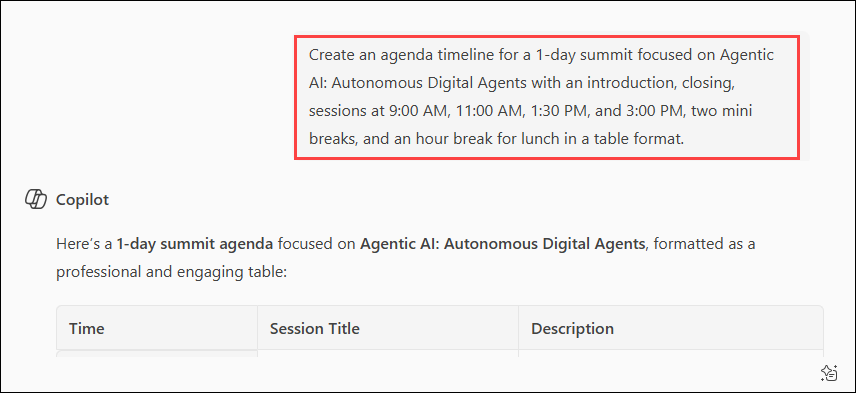

1. Enter this follow-up prompt:

   ```
   Create a simple and modern logo for this client innovation summit.
   ```

1. Select **Send**, review the image provided by Copilot and if needed, refine the prompt.

    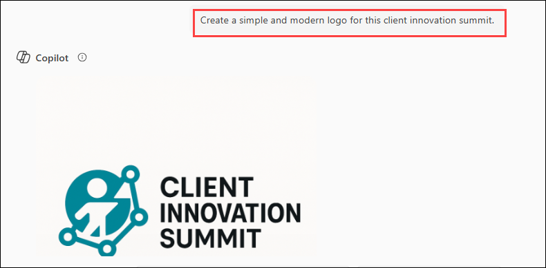

## Task 4: Draft a planning document for the summit

In this task, you will prompt Copilot to generate a one-page planning brief that includes event goals, target audience, session themes, and key planning milestones. You will then paste the content into a Word document and give it a title.

1. In the same chat with Copilot, enter this prompt:

   ```
   Create a 1-page planning brief for this client innovation summit that includes: goals, audience, session themes, and key planning milestones.
   ```
   
1. Select **Send**, review the information provided by Copilot and if needed, refine the prompt.

   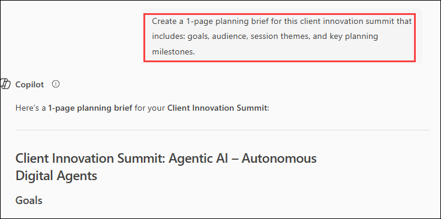

1. Enter this follow-up prompt:

   ```
   Add a section summarizing anticipated outcomes and success metrics for the event.
   ```

1. Select **Send**, review the information provided by Copilot and if needed, refine the prompt.

1. Select **Copy** underneath the response to copy Copilot’s response.

   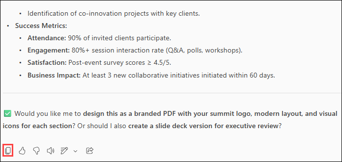

1. Open a new browser tab and navigate to `https://m365.cloud.microsoft.com`.

1. From the left-hand navigation pane, select **Apps (1)**, then click on **Word (2)**.

   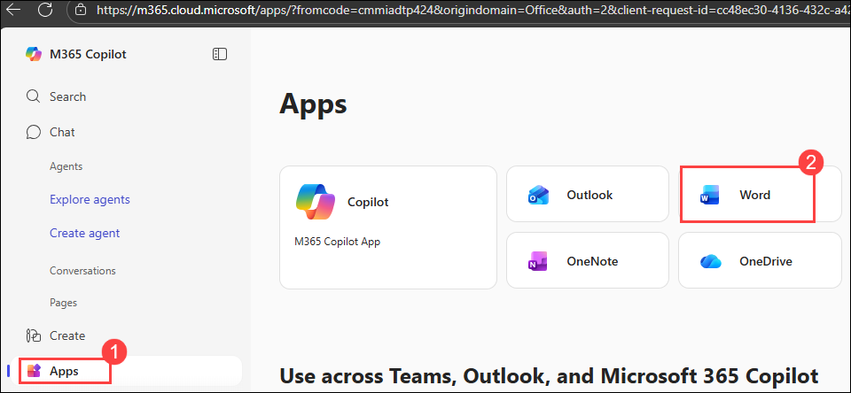

1. Click **Create blank document**.

   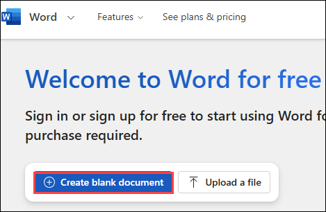

1. If prompted to sign in, enter your email: **<inject key="AzureAdUserEmail"></inject>**, and click **Next**.

1. On the **Enter password** screen, input **<inject key="AzureAdUserPassword"></inject>**, then click **Sign in**.

1. If asked **"Stay signed in?"**, check the **Don't show this again** box and select **Yes**.

1. Paste the previously copied Copilot response into the Word document.

1. Give the document a title: **Client Summit Planning Brief**.

1. Navigate back to your Copilot Chat conversation to complete task 5.

## Task 5: Analyze and generate content from a file

In this task, you’ll upload the planning brief from Task 4 and have Copilot summarize it and generate an internal communication. This shows how Copilot can save time by turning documents into digestible, action-ready content.

1. Continue in Copilot Chat, enter this prompt and upload the file you created in Task 4: 

    ```
    Summarize the key points from this planning brief into only 5 condensed bullet points
    ```

1. Click the **+ icon** located at the bottom-left corner of the prompt box to **attach a cloud file**.

   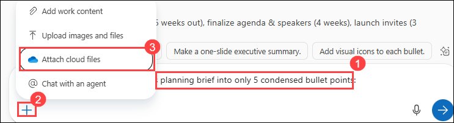

1. In the file picker, check the box next to the Word document created in the previous task, then click **Select**.

   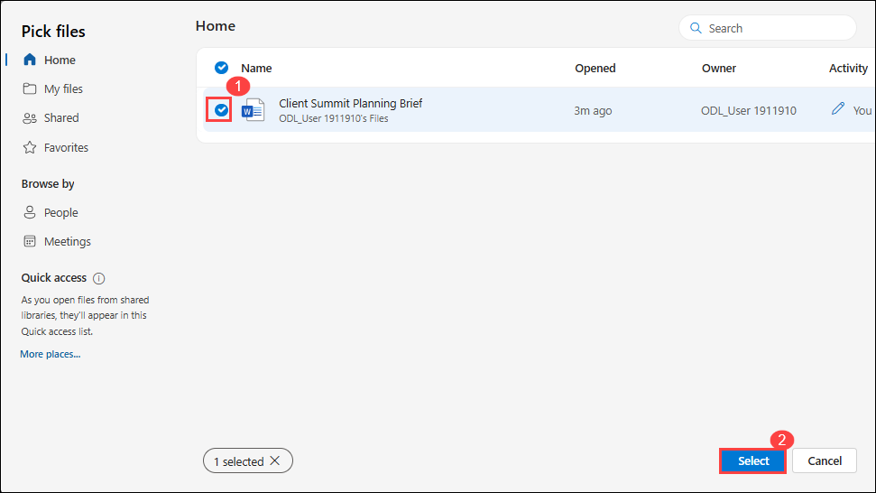

1. Once you see the file has been uploaded to the prompt box, select **Send**.

1. Review the information provided by Copilot and if needed, refine the prompt.

1. Enter this follow-up prompt:

    ```
    Write a follow-up email to the planning team with these highlights and the next step.
    ```

1. Select **Send**, review the information provided by Copilot and if needed, refine the prompt.

## Task 6: Collaborate using Copilot Pages

In this task, you will convert the draft email into a collaborative Copilot Page. You’ll explore how to edit, add content, and share the page—simulating real-time teamwork and content co-creation.

1. Select **Edit in Pages** underneath Copilot’s last response in **Task 5** (or any response you prefer) to copy over that information to Copilot Pages.

   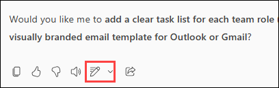

1. A new Copilot Page will open on the right pane of Copilot Chat, explore the following actions:

    - Give the page a new title at the top of the page.  

    - Type any additional content throughout the page by just clicking into the page.

    - Add an additional Copilot Chat response (previous or new) to the page by selecting **Add to page** at the bottom of the response. 

      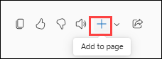

    - Enter **"/"** to insert content blocks, such as a table, or checklist.

    - Optionally, share your page by selecting the **Share** icon at the top right of the page and selecting one of the two options to copy a link.

## Optional Wrap-Up Task: Review and Reflect

In this task, you will reflect on your learning by prompting Copilot to create a checklist of key takeaways from the lab and how they apply to your current role.

1. In the same chat with Copilot, enter this prompt:

   ```
   Create a checklist of what I learned today using Copilot Chat and how I can apply it to my [role].+++
   ```

   >**NOTE:** Replace [role] with your role.

## Summary

In this lab, you explored how Microsoft 365 Copilot Chat can enhance productivity, creativity, and collaboration in a real-world business scenario—planning a Client Innovation Summit. Taking on the role of a business operations associate, you used Copilot to research industry trends, brainstorm session ideas, visualize an agenda, generate branded materials, and draft a planning document.

You then advanced the workflow by summarizing content from a Word document, creating follow-up communication, and collaborating through Copilot Pages. Each task demonstrated how Copilot can assist in transforming ideas into actionable content, saving time and improving the quality of work.

By the end of this lab, you gained hands-on experience in:

Prompting and refining responses with Copilot Chat

Turning raw insights into structured planning documents

Using AI to support communication and content creation

Collaborating in real time using Microsoft 365 tools

This lab highlights how Microsoft 365 Copilot can act as a valuable assistant in professional settings—helping you think, write, plan, and collaborate more effectively.
