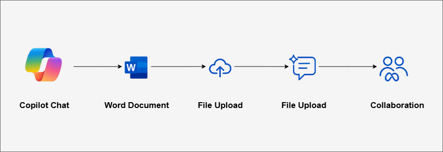
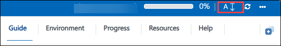
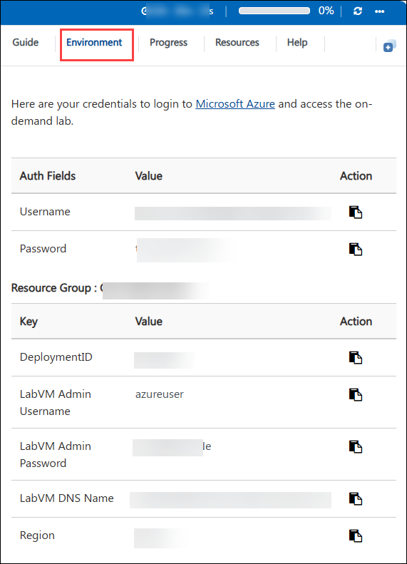
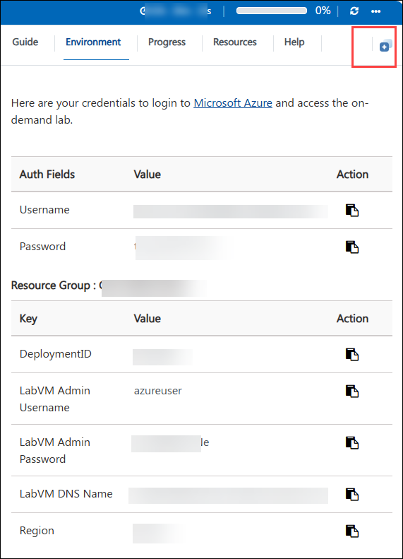
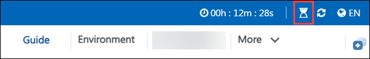
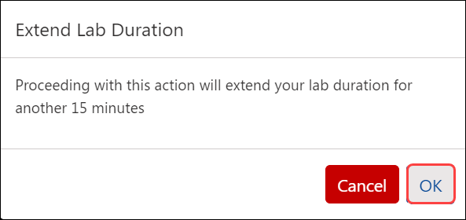

#  MS-4023 : Explore Microsoft 365 Copilot chat 
##  Lab 1 – Plan a Client Summit with Microsoft 365 Copilot Chat

###  Overall Estimated Time: 60 minutes

##  **Overview**

In this hands-on lab, you'll take on the role of a **Business Operations Associate** tasked with planning a **Client Innovation Summit**. Using **Microsoft 365 Copilot Chat**, you’ll explore how AI can streamline and enhance event planning workflows—from trend analysis to documentation and collaboration.

You'll begin by prompting Copilot to summarize current industry trends, then transform those insights into session ideas, a visual agenda, and a project brief. You’ll also experience how to collaborate effectively by generating summaries, writing internal communications, and co-editing content in Copilot Pages.

This lab is designed to demonstrate **practical, real-world applications** of Copilot for content generation, planning, and teamwork within the Microsoft 365 ecosystem.

By the end of this lab, you'll understand how Microsoft 365 Copilot can serve as a powerful productivity assistant that helps you plan, write, ideate, and collaborate—all with natural language.

##  **Objectives**

By the end of this lab, you will be able to:

- Use **Microsoft 365 Copilot Chat** to summarize industry trends and apply them to business planning.
- Generate creative and compelling **session ideas** for an event.
- Create visual elements like a **timeline agenda** and **event logo**.
- Draft a professional **event planning brief** and format it in Word.
- Analyze a document to extract summaries and write **follow-up emails**.
- Collaborate in real time by converting Copilot content into **Copilot Pages**.
- Reflect on your learning with a personalized **takeaway checklist**.

##  **Tasks in This Lab**

You will complete the following tasks:

1. **Summarize Industry Trends for Event Planning**  
2. **Brainstorm and Draft Session Ideas**  
3. **Visualize the Agenda Timeline and Create a Logo**  
4. **Draft a Planning Document for the Summit**  
5. **Analyze and Generate Content from a File**  
6. **Collaborate Using Copilot Pages**  
7. **Reflect and Apply Your Learning**

##  **Pre-requisites**

To successfully complete this lab, you should have:

- A basic understanding of Microsoft 365 apps and productivity workflows.
- Familiarity with web-based tools such as Word Online.
- An interest in how AI can enhance business planning and communication.

No prior experience with AI or coding is required.

##  **Architecture**

This lab uses Microsoft 365 tools and services with Copilot integrated across the ecosystem. Here’s how the architecture works:

###  Microsoft 365 Copilot Chat and Word:

- Prompt-based AI assistant for generating and refining ideas
- Natural language interaction with productivity data
- Seamless export to Microsoft Word for document creation

###  File Analysis and Copilot Pages:

- Upload Word documents to Copilot for summarization and repurposing
- Transform Copilot responses into collaborative Copilot Pages
- Real-time co-editing and sharing for internal planning workflows

##  **Architecture Diagram**

   

##  **Explanation of Components**

###  Microsoft 365 Copilot Chat  
The conversational interface where you interact with the AI using prompts. Copilot understands context, provides insights, and generates useful business content like session ideas or planning briefs.

###  Word Online (via Microsoft 365 Apps)  
Used to format, store, and organize generated content. You’ll paste Copilot responses here to create shareable planning documents.

###  Cloud File Upload  
Allows you to upload your Word planning brief into Copilot Chat so the AI can analyze and summarize content directly from your document.

###  Copilot Pages  
An editable, collaborative space where Copilot-generated content can be transformed into internal resources. Ideal for planning meetings, drafting emails, or refining content with your team.

# Getting Started with lab

Welcome to your Lab 01: lan a Client Summit with Microsoft 365 Copilot Chat Lab! We've prepared a seamless environment for you to explore and learn how to transform business content into an engaging, client-ready presentation using Copilot. Let's begin by making the most of this experience:

## Accessing Your Lab Environment
 
Once you're ready to dive in, your virtual machine and **Guide** will be right at your fingertips within your web browser.
 

## Lab Guide Zoom In/Zoom Out
 
To adjust the zoom level for the environment page, click the **A↕: 100%** icon located next to the timer in the lab environment.

### Virtual Machine & Lab Guide
 
Your virtual machine is your workhorse throughout the workshop. The lab guide is your roadmap to success.

## Exploring Your Lab Resources
 
To get a better understanding of your lab resources and credentials, navigate to the **Environment** tab.
 

## Utilizing the Split Window Feature
 
For convenience, you can open the lab guide in a separate window by selecting the **Split Window** button from the Top right corner.
 

## Lab Duration Extension

1. To extend the duration of the lab, kindly click the **Hourglass** icon in the top right corner of the lab environment. 

    

    >**Note:** You will get the **Hourglass** icon when 10 minutes are remaining in the lab.

2. Click **OK** to extend your lab duration.
 
    

3. If you have not extended the duration prior to when the lab is about to end, a pop-up will appear, giving you the option to extend. Click **OK** to proceed.

## Support Contact
 
The CloudLabs support team is available 24/7, 365 days a year, via email and live chat to ensure seamless assistance at any time. We offer dedicated support channels explicitly tailored for both learners and instructors, ensuring that all your needs are promptly and efficiently addressed.
 
Learner Support Contacts:
 
- Email Support: cloudlabs-support@spektrasystems.com
- Live Chat Support: https://cloudlabs.ai/labs-support

Click on **Next** from the lower right corner to move on to the next page.

   

## Happy Learning !!

